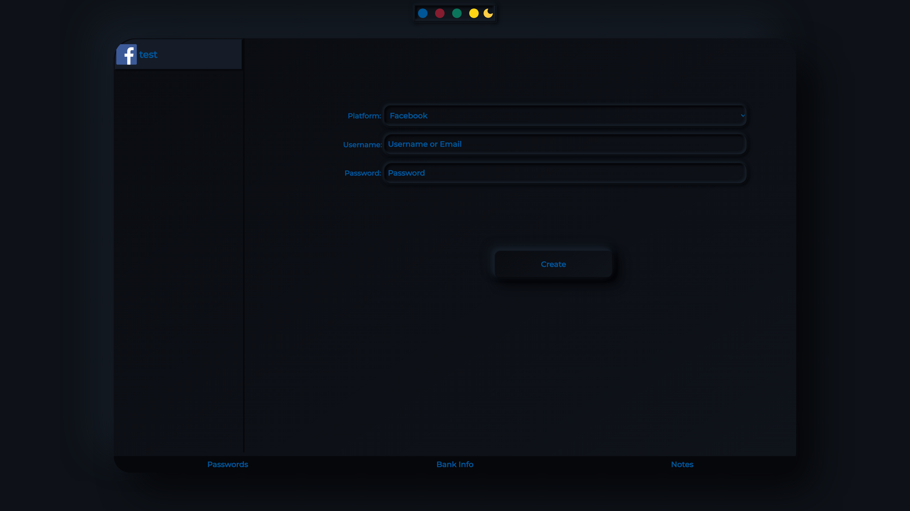
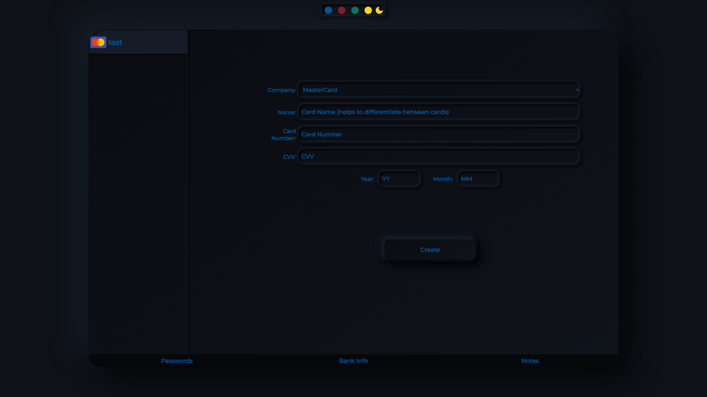
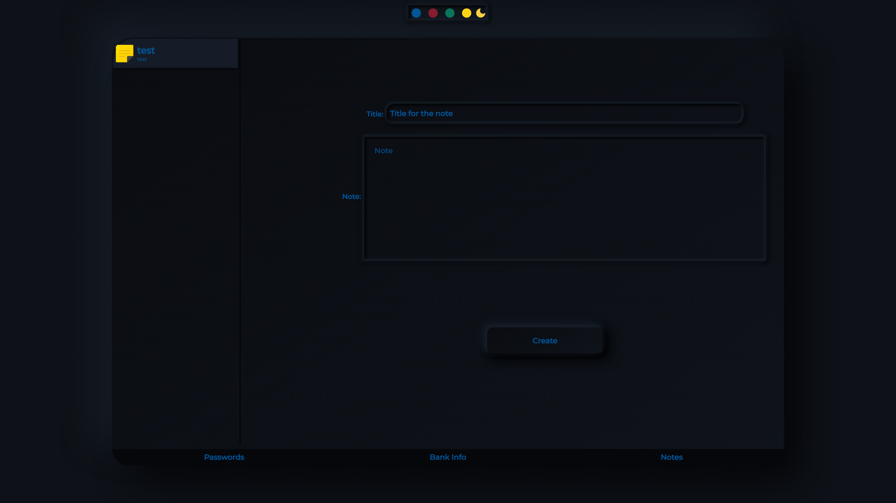
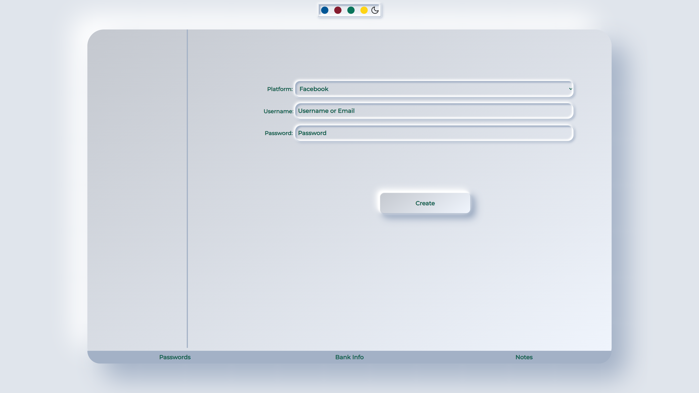

<h1 style="text-align:center;color:#005696;"> Password Manager</h1>

> IMPORTANT this is not a password manager you would really use in your daily life this is just a side project i used to learn electron and gain some knowledge in cryptography i am not expert in cryptography by any mean if you want password manager to use github has a lot of free amazing managers to use

### Passwords

### Credit Cards

### Notes

### Change Theme And Color
